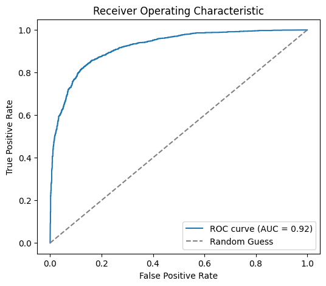
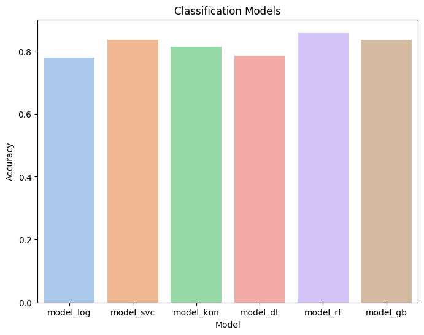
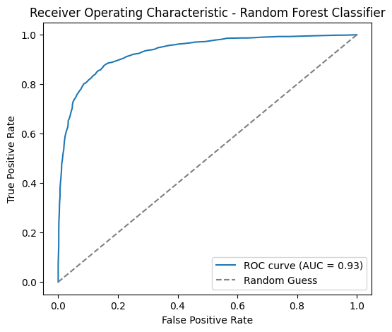
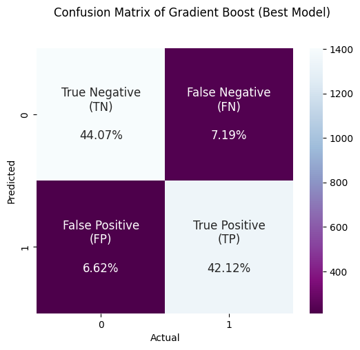
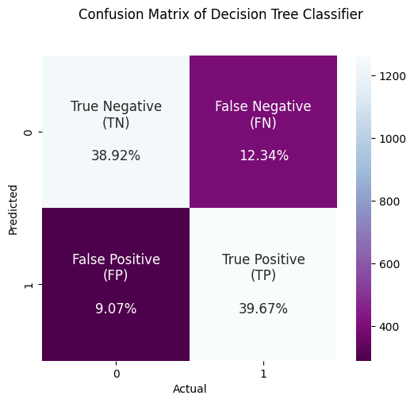
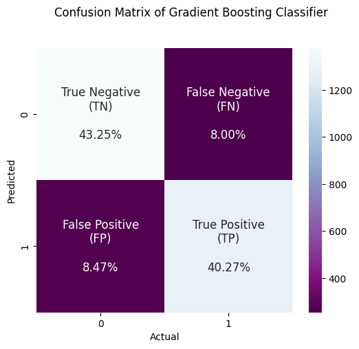
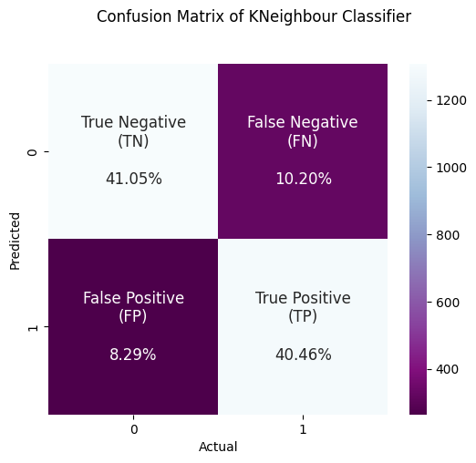
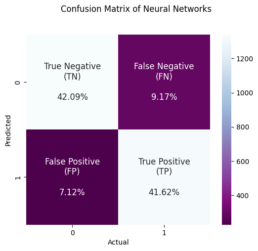
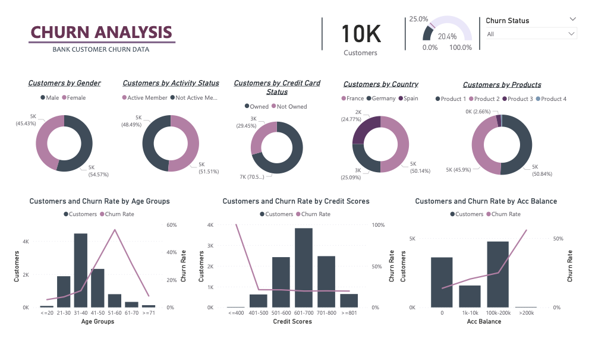

# Churn Prediction +

### Problem Statement

Customer churn, also known as customer attrition, refers to the tendency of customers to discontinue using a company's products or services. The churn rate represents the percentage of customers who leave the company during a specific period. It is crucial for businesses, like the esteemed "ABC BANK," to accurately predict customer churn to minimize losses and maintain a strong reputation.

### Objective

The objective of this project is to build a churn prediction model using various machine learning approaches. By leveraging advanced machine learning algorithms, including neural networks, we aim to develop a model that can provide the best predictions for customer churn. The ultimate goal is to assist "ABC BANK" in proactively addressing churn, reducing churn rates, and fostering long-term customer relationships.

### Prerequisite

- Anaconda 3
- Python 3

### Dataset Description

The dataset consists of 10,000 rows and 12 columns, with the target variable labeled as 'churn.'

| Feature          | Description                                                                                                                            |
| ---------------- | -------------------------------------------------------------------------------------------------------------------------------------- |
| Credit score     | Customers with higher credit scores are generally more financially stable and reliable, which may reduce churn.                        |
| Country          | Different countries may have varying economic conditions, banking regulations, and customer behavior, impacting churn rates.           |
| Gender           | This feature might provide insights into gender-based differences in customer loyalty and churn behavior.                              |
| Age              | Older customers often have longer relationships with the bank and are less likely to churn.                                            |
| Tenure           | Longer tenure indicates greater loyalty and a lower likelihood of churn compared to newer customers.                                   |
| Balance          | Customers with higher account balances are generally more invested in the bank's services, making them less likely to churn.           |
| Products number  | Customers using more products/services from the bank are more deeply engaged, making them less likely to churn.                        |
| Credit card      | Customers with credit cards may have higher engagement with the bank, reducing churn.                                                  |
| Active member    | Active members are more likely to be engaged with the bank's offerings, leading to decreased churn rates.                              |
| Estimated salary | Customers with higher salaries may have more stable financial situations and be less likely to churn.                                  |
| Churn            | The target variable indicating whether the customer left the bank or not. This is the variable to be predicted using machine learning. |

### Working Flow

**1.Import Libraries** : Import necessary Python libraries, including scikit-learn, pandas, numpy, seaborn, and matplotlib.

**2.Load Dataset** : Load the dataset into a pandas DataFrame to work with the data.

**3.Feature Engineering** :

- Handling Missing Values: Fill or remove missing values in the dataset to prepare it for modeling.
- One-Hot Encoding: Convert categorical variables into numerical representation using one-hot encoding.
- Handling Imbalanced Dataset: Use SMOTE (Synthetic Minority Over-sampling Technique) to address class imbalance.
  **4. Data Visualization:**

- Explored the dataset using data visualization techniques, like bar plots, histograms, and box plots, to gain insights into the distribution of categorical and numerical features.
  **4.Train-Test Split**: Split the dataset into training and testing subsets to train the model on one portion and evaluate it on another.

**5.Feature Scaling**: Standardized the numerical features to ensure they are on a similar scale for better model performance.

**6.Correlation Analysis**: Checked for correlations between features using a heatmap to identify potential linear relationships with the target variable.

**7.Model Selection**: Select multiple classifiers to evaluate their performance on the given dataset. The algorithms used are Logistic Regression, K-Nearest Neighbors (KNN), Support Vector Machine (SVM), Decision Trees, Random Forest, Gradient Boosting, and Neural Networks.

**8.Metric Selection**:The metrics choosed are Recall and Roc because Prioritizing recall ensures that the model can avoid mistakenly predicting no churn that is actually churn, thereby increasing the chances of taking proactive action to retain those customers and having a good business impact. In addition, the ROC-AUC score provides a comprehensive measure of the model's performance across various classification thresholds and demonstrates the model's ability to correctly rank classes.

**7.Model Evaluation**: Trained each selected model, evaluated its performance using cross-validation, and compare the results based on recall and ROC-AUC scores.

**8Hyperparameter Tuning**: Performed hyperparameter tunning to improve model accuracy using techniques like RandomizedSearchCV to find the best parameter combinations for each model.

**9.Model Selection and Finalization**:Gradient Boosting Classifier achieved the highest recall and ROC-AUC scores, making it the best-performing model based on evaluation metrics.

**10.Concatenate Predictions**: Combine the predicted values from the best model with the actual target values into a result DataFrame.

## Business Insights

**1. Model Performance**:
The churn prediction model seems to have reasonable performance with an **82%** recall, indicating that it can correctly identify a high proportion of actual churn cases. Additionally, the ROC-AUC score of **90%** indicates that the model has good discrimination power to distinguish between churn and non-churn instances.

**2.Demographic Insights**:

- Female customers have a higher churn percentage **11.4%** compared to male customers **9%**. This observation might prompt further investigation into the reasons behind the higher churn rate among female customers.

- Customers in the **40-50 age group** exhibit the **highest churn rate**. Understanding the factors leading to higher churn in this age group can be valuable for targeted retention efforts.

- Churn percentages vary across different countries, with **France and Germany** having a churn percentage of **8.1%** each and **Spain with 4.1%**. Analyzing country-specific trends could help in tailoring retention strategies.
  **3. Customer Engagement Insights**:

- **Inactive members have a higher churn** percentage **13%** compared to active customers. Encouraging inactive customers to engage more with the bank's products and services might reduce churn.
- **Customers with credit cards** have a **higher churn percentage of 14.2%** compared to those without credit cards 6.1%. Understanding the reasons behind this trend can help in designing retention strategies for credit card holders.
  **4.Product Insights**:
  Customers who purchased **at least one product** through the bank have a **higher churn percentage 14.1%**. Understanding the relationship between customer purchases and churn behavior can lead to targeted product offerings and promotions.

**5. Credit Score, and Balance Distribution**:

- The credit score distribution being similar for churn and retain customers suggests that creditworthiness might not be the primary driver of churn.
- The balance distribution for churned and retained customers also doesn't show a clear distinction, indicating that account balance alone might not be the main factor influencing churn.

Overall, the business insights gleaned from the churn prediction model and the observed data provide valuable directions for customer retention strategies. Further analysis and targeted actions based on these insights can help the bank in reducing churn, improving customer loyalty, and enhancing overall business performance.

## Model Performance:

| Best model-ROC                                          | Model Accuracy                                          | ROC-AUC                                   |
| ------------------------------------------------------- | ------------------------------------------------------- | ----------------------------------------- |
|  |  |  |

## Model's Confusion Matrices:

| Best Model CM                                 | CM-Decision Tree                                    | CM-Gradient Boost                                     |
| --------------------------------------------- | --------------------------------------------------- | ----------------------------------------------------- |
|  |  |  |

| CM-KNN                          | CM-Neural Networks                                      | CM-Random Forest                                    |
| ------------------------------- | ------------------------------------------------------- | --------------------------------------------------- |
|  |  |  |

## Churn Analysis Report

